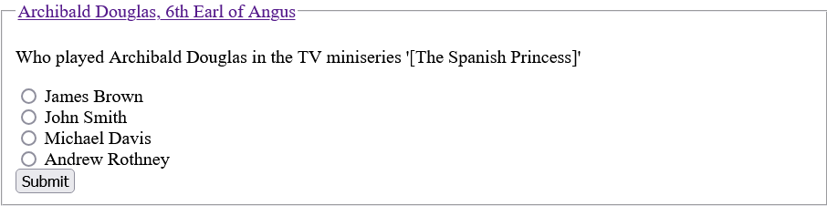

+++
title = 'Asking questions (pt. 2)'
date = 2024-08-19T08:00:00+02:00
tags = ['data engineering', 'trivia', 'large language model']
ShowReadingTime = true
description = 'Generating trivia questions using an LLM, based on Wikipedia data.'

[cover]
image = 'mindmaze.png'
alt = "Mindmaze - Copyright Microsoft 1993"
caption = "Mindmaze - Copyright Microsoft 1993"
relative = true

# publishDate = 
# lastmod = 
# showtoc = 
+++

Last time, we talked about preparing the data for our question generating system. To recall, this was the rough plan:

1. Fetch and prepare Wikipedia data (see more [here](https://mkolarek.github.io/posts/asking-questions-pt-1/))
2. Prompt an LLM for a question based on passed-in Wikipedia article (the focus of today's post)

There's a wide range of different LLM services available online, but for our purposes we're going to use something that's open-source and that we can run locally on our machine - [ollama](https://ollama.com). This is a tool that acts as a wrapper around popular, freely available models by providing a uniform API and CLI, and it downloads and manages the models for us.

Our plan for using the LLM is:

1. Deploy a model locally (e.g. `llama3`)
2. Query our database for a random Wikipedia article
3. Pass in contents of Wikipedia article as part of a prompt to our model
4. Receive multiple-choice question based on article

## Deploying a model using ollama

To keep our setup as clean and reproducible as possible, we're going to use the official Docker image of `ollama`. 

Running the container:

```
docker run -d --gpus=all -v ollama:/root/.ollama -p 11434:11434 --name ollama ollama/ollama
```

And then accessing the prompt interface:

```
docker exec -it ollama ollama run llama3
```

(This may take longer when you run it for the first time since the model file needs to be downloaded and it can be quite large.)

Here we can try out a few prompts, to confirm that everything works as expected. If you have a compatible GPU, the inference of the model should be quicker.

```
>>> Why is the sky blue? Answer briefly, please.
The sky appears blue because shorter wavelengths of light (like blue and violet) are scattered
more efficiently by tiny molecules in the atmosphere than longer wavelengths (like red and
orange).
```

Let's also try out the API:

```bash
$ curl http://localhost:11434/api/generate -d '{
  "model": "llama3",
  "prompt": "Why is the sky blue? Answer briefly, please.",
  "stream": false
}' | jq .
  % Total    % Received % Xferd  Average Speed   Time    Time     Time  Current
                                 Dload  Upload   Total   Spent    Left  Speed
100  1028  100   926  100   102    126     13  0:00:07  0:00:07 --:--:--   295
{
  "model": "llama3",
  "created_at": "2024-08-12T13:03:44.398010891Z",
  "response": "The sky appears blue because of a phenomenon called Rayleigh scattering, where shorter (blue) wavelengths of light are scattered more than longer (red) wavelengths by tiny molecules of gases in the atmosphere, like nitrogen and oxygen. This scattering effect gives the sky its blue color!",
  "done": true,
  "done_reason": "stop",
  "context": [
    128006,
    882,
    128007,
    271,
    10445,
    374,
    279,
    13180,
    6437,
    30,
    22559,
    27851,
    11,
    4587,
    13,
    128009,
    128006,
    78191,
    128007,
    271,
    791,
    13180,
    8111,
    6437,
    1606,
    315,
    264,
    25885,
    2663,
    13558,
    64069,
    72916,
    11,
    1405,
    24210,
    320,
    12481,
    8,
    93959,
    315,
    3177,
    527,
    38067,
    810,
    1109,
    5129,
    320,
    1171,
    8,
    93959,
    555,
    13987,
    35715,
    315,
    45612,
    304,
    279,
    16975,
    11,
    1093,
    47503,
    323,
    24463,
    13,
    1115,
    72916,
    2515,
    6835,
    279,
    13180,
    1202,
    6437,
    1933,
    0
  ],
  "total_duration": 7280177133,
  "load_duration": 16705909,
  "prompt_eval_count": 21,
  "prompt_eval_duration": 326095000,
  "eval_count": 55,
  "eval_duration": 6880157000
}
```

We've sent out a request via `curl`, containing the same prompt. What we've done a bit differently though, is that we've requested a non-streaming response (by setting `stream` as false), so that we get our whole response at once.


## Getting a random Wikipedia article from our database

The simplest approach we can take here is to pick a random number (X) between 1 and N, where N is equal to the number of Wikipedia articles in our database, and then to query the contents of the X-th article.

Before we can do that though, we need to assign each article an incremental ID. Although we already have an ID that came from our original dataset, this ID unfortunately isn't sequential, and we've already filtered out some articles (and their IDs) when we removed redirects.

Let's launch our `psql` interface and run:

```SQL
wiki=>ALTER TABLE wiki.wiki ADD row_id SERIAL;
ALTER
```

(This will take a while.)

We have now added a new column `row_id` to our `wiki` table that is of (pseudo-)type `SERIAL`, meaning it's auto-incrementing.

Let's try to query a random article's title:

```SQL
wiki=>SELECT title 
FROM wiki.wiki 
WHERE row_id = (
    SELECT floor(random() * COUNT(title) + 1)::int 
    FROM wiki.wiki
);
         title
------------------------
 Simply Red discography
(1 row)
```

By running this a few times we can confirm that we get different random articles. Although, something seems to be a bit off... There are some article titles starting with the prefix `Category:`. Having taken a closer look into these, it seems that they aren't "true" articles, but rather meta-articles. They don't contain direct information about a topic, but instead they contain information about other articles. This isn't useful for our use-case, so we should think about removing these from our database. 

### Some ad-hoc data cleaning

Let's see if there are any other similar meta-articles:

```SQL
SELECT DISTINCT(SUBSTRING(title from '.*\:[^ ]')) 
FROM wiki.wiki 
WHERE title LIKE '%:%';
```

What we're doing here is, we are looking for all article title starting with a string, followed immediately by a colon and then a string again, e.g. `Category:Women of Belgium by activity`. From there we want to extract the part until the first colon, e.g. `Category:`.

Looking at the results, we see a lot of valid article titles, but also some that seem meta:

```
Wikipedia:
Template:
Draft:
Category:
Portal:
File:
```

Let's clean all of these up:

```SQL
wiki=>DELETE FROM wiki.wiki 
WHERE title LIKE 'Wikipedia:%' 
    OR title LIKE 'Template:%' 
    OR title LIKE 'Draft:%' 
    OR title LIKE 'Category:%' 
    OR title LIKE 'Portal:%' 
    OR title LIKE 'File:%';
```

The bad news is, we've now broken our `row_id`, since we have gaps in the ID sequence (although it's `SERIAL`, the auto-incrementing only works on newly added rows, not on already existing ones).

First we need to drop the column:

```SQL
wiki=>ALTER TABLE wiki.wiki DROP COLUMN row_id;
ALTER
```

And then re-create the `row_id`:

```SQL
wiki=>ALTER TABLE wiki.wiki ADD row_id SERIAL;
ALTER
```

Let's also have a look at how we can add this filtering to our ETL job from our previous post:

```python
...
(
    df.filter(df.redirect._title.isNull())
    .filter(~df.title.contains("Wikipedia:"))
    .filter(~df.title.contains("Template:"))
    .filter(~df.title.contains("Draft:"))
    .filter(~df.title.contains("Category:"))
    .filter(~df.title.contains("Portal:"))
    .filter(~df.title.contains("File:"))
    .createOrReplaceTempView("wiki")
)
...
```

***

Great! Now that we have all of our components ready, let's put them together.

## Question generator API

While we could just write a script that does the necessary steps for us and provides us with a new question every time we run it, I decided to build a small API service instead. This way it can become a component of a larger system (i.e. a game like MindMaze), while also being easily accessible via a web browser. To keep things simple, I've decided to use `flask`, since it has built-in support both for providing API endpoints and for HTML templating (if we want a nicer UI).

Let's go through the whole web app piece by piece. Aside from the imports, what's interesting here is that we've prepared an example question response that we'd like our LLM to return for us (we'll be using it later). Some very basic (and insecure!) secrets and connection strings are also initialised here.

```python
from flask import Flask, render_template, request, redirect, url_for
import psycopg
import requests

import json
import random
import time

app = Flask(__name__)
app.config["SECRET_KEY"] = "your secret key"

DB_CONN_STRING = "host=localhost dbname=wiki user=wiki password=wiki"
OLLAMA_HOST = "http://localhost:11434"

EXAMPLE_QUESTION = {
    "question_text": "Question text?",
    "answers": [
        {"selection": "a", "answer_text": "First answer"},
        {"selection": "b", "answer_text": "Second answer"},
        {"selection": "c", "answer_text": "Third answer"},
        {"selection": "d", "answer_text": "Fourth answer"},
    ],
    "correct_answer": "a",
}
```

While we have previously done all our of querying in one SQL query (both the number of articles and fetching a single random article), here we've broken that into two steps, since we only need to fetch the number of articles once.

```python
app.logger.info("Getting number of articles...")

tic = time.perf_counter()
with psycopg.connect("host=127.0.0.1 dbname=wiki user=wiki password=wiki") as conn:
    with conn.cursor() as cur:
        cur.execute("SELECT COUNT(title) FROM wiki.wiki;")
        for record in cur:
            app.logger.info("Number of articles: %s", record[0])
            NUMBER_OF_ROWS = record[0]
toc = time.perf_counter()
app.logger.info("Number of articles fetched in %0.4f seconds.", toc - tic)
```

Fetching a random article and its title is pretty straightforward.

```python
def get_random_article():
    row_id = random.randrange(NUMBER_OF_ROWS)

    with psycopg.connect(DB_CONN_STRING) as conn:
        with conn.cursor() as cur:
            cur.execute(
                """SELECT title, \"revision_text__VALUE\"
                FROM wiki.wiki 
                WHERE row_id = {};""".format(row_id)
            )
            for record in cur:
                app.logger.info("Article title and row_id: %s, %s", record[0], row_id)
                return record
```

Generating the question itself is also straightforward, with the prompt being the most interesting part. The most important parts of the prompt are:

- limiting the question generation **only** on the provided article content
- responding in JSON format, following the provided example

We've added some string cleaning of the prompt just in case, since the LLM would sometimes include additional text regardless of our prompt, e.g. "Here's the JSON response: ". 

```python
def generate_question(article_content):
    headers = {
        "Content-Type": "application/x-www-form-urlencoded",
    }

    data = {
        "model": "llama3",
        "prompt": "Please generate a multiple-choice question with four possible answers, based on the following article: {}. Base your question only on the provided article content. Only respond with a JSON response. Base your JSON response on the following example {}".format(
            article_content, EXAMPLE_QUESTION
        ),
        "stream": False,
    }

    response = requests.post(
        OLLAMA_HOST + "/api/generate", headers=headers, data=json.dumps(data)
    )

    app.logger.info("Response: %s", response.json())

    question = (
        "{" + response.json()["response"].split("{", 1)[1].rsplit("}", 1)[0] + "}"
    )

    app.logger.info("Question: %s", question)

    return question
```

Here's our main endpoint, where it all comes together. When we make a `GET` request to the endpoint, we trigger the random article fetch and question generation. We also extend the JSON response by adding the article title and the article Wikipedia link.

When we make a `POST` request to the endpoint (i.e. when we submit our answer), we check whether the answer was correct and forward the answer/correct answer pair to the result page.

```python
@app.route("/question", methods=["GET", "POST"])
def question():
    if request.method == "POST":
        if request.form["answer"] == request.form["correct_answer"]:
            app.logger.info("Correct answer!")
        else:
            app.logger.info("Wrong answer.")
        return redirect(
            url_for(
                "result",
                answer=request.form["answer"],
                correct_answer=request.form["correct_answer"],
            )
        )

    app.logger.info("Getting random article...")

    tic = time.perf_counter()
    random_article = get_random_article()
    toc = time.perf_counter()
    app.logger.info("Article fetched in %0.4f seconds.", toc - tic)

    app.logger.info("Generating question...")
    tic = time.perf_counter()
    question_string = generate_question(article_content=random_article)
    toc = time.perf_counter()
    app.logger.info("Question generated in %0.4f seconds.", toc - tic)

    question_json = json.loads(question_string)
    question_json["article_title"] = random_article[0]
    question_json["article_link"] = "https://en.wikipedia.org/wiki/{}".format(
        random_article[0].replace(" ", "_")
    )
    random.shuffle(question_json["answers"])

    return render_template("question.html", question=question_json)
```

And here's the accompanying template:

```html
<!doctype html>
<html>
<title>Question generator</title>

<body>
  <form method="post">
    <fieldset>
      <legend><a href="{{ question["article_link"] }}" target="blank">{{ question["article_title"] }}</a></legend>

      <div>
        <p>{{ question["question_text"] }}</p>
      </div>

      
      <div>
        <input type="radio" id="{{ answer["selection"] }}" name="answer" value="{{ answer["selection"] }}" />
        <label for="{{ answer["selection"] }}">{{ answer["answer_text"] }}</label>
      </div>
      

      <div>
        <input type="hidden" id="correct_answer" name="correct_answer" value="{{ question["correct_answer"] }}" />
      </div>

      <button>Submit</button>

    </fieldset>
  </form>
  <div class="content">
    
    <div class="alert">{{ message }}</div>
    
     
  </div>
</body>

</html>
```

Finally, here's our result page rendering endpoint and its template.

```python
@app.route("/question/result", methods=["GET"])
def result():
    app.logger.info(
        "Request content on result page: %s, %s",
        request.args["answer"],
        request.args["correct_answer"],
    )
    return render_template(
        "result.html",
        answer=request.args["answer"],
        correct_answer=request.args["correct_answer"],
    )
```

```html
<!doctype html>
<html>
<title>Result page</title>

<body>
  <h1>Result page</h1>
  
  <p>Congratulations! You got it right!</p>
  
  <p>Sorry, you got it wrong!</p>
  
  <form action={{ url_for("question") }}>
    <input type="submit" value="New question!" />
  </form>
  <div class="content">
    
    <div class="alert">{{ message }}</div>
    
     
  </div>
</body>

</html>
```

## Answering questions

Now we come to the fun part! Let's run our `flask` web app and try to answer a couple of questions:

```bash
flask --app=app.py run --debug
```

And we should see a question eventually show up at `http://127.0.0.1/question`:



The web app is quite rough around the edges, but it allows us to generate and answer questions with ease. There's certainly a lot that can be improved:

- **Question quality**: It quickly becomes apparent that picking a random Wikipedia article doesn't always generate a "good" question, i.e. a question that an average person could know the answer to.
- **Performance**: While the LLM is relatively quick (on my machine it takes ~30 seconds to generate a response), it could be quicker, and the interface could look nicer while the user awaits their question.
- **Question categories**: Similar to the first point, there's no way to control the category of question we'd like (sports, science, etc.) because the random article fetching always uses the whole dataset.

We'll wrap it up for now though, and enjoy some trivia!

Cheers,  
Marko
