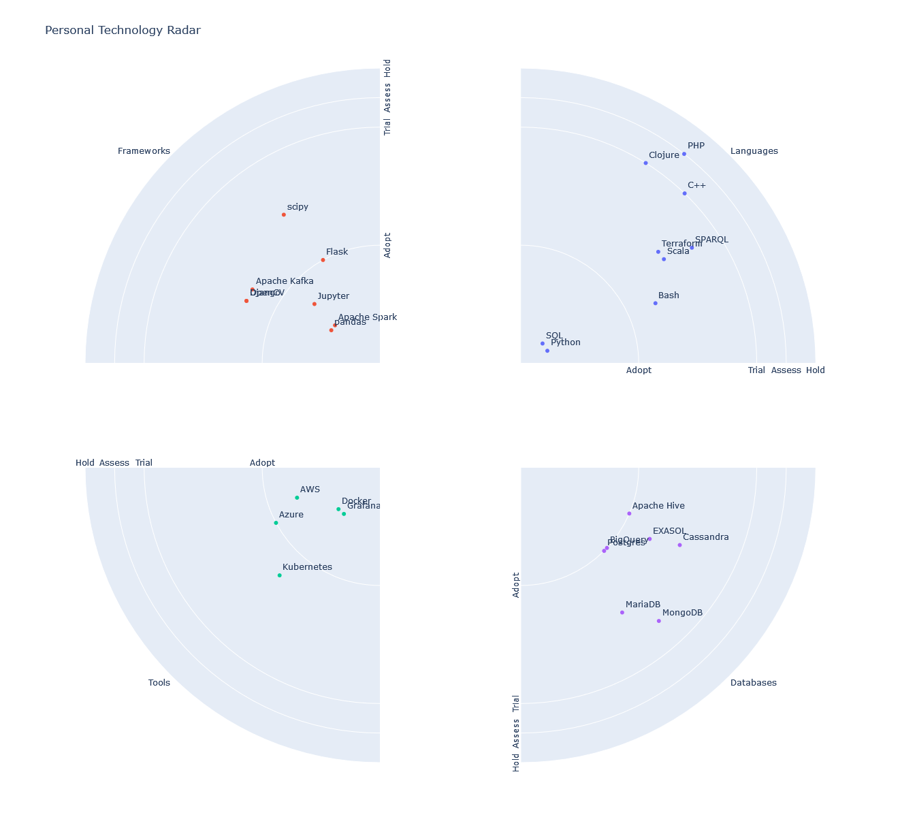

+++
title = 'Personal Technology Radar'
date = 2024-06-25T12:00:00+02:00
tags = ['Data Visualization']
+++

One type of data visualization I particularly enjoy is the [technology radar](https://www.thoughtworks.com/radar). If you're unfamiliar, it provides an overview of the languages, frameworks, tools, and other technologies currently in use at a company—a snapshot in time. What makes it fascinating is that it doesn't present a simple black-and-white picture, such as merely listing the languages a company endorses or uses.

Instead, it features a plot divided into areas labeled "Adopt," "Trial," "Assess," and "Hold." Each area represents the level of adoption for a given technology within the company:
- **Adopt**: Well-established and used in production.
- **Trial**: Ready for use but not yet proven to the level of "Adopt."
- **Assess**: Appears promising but isn't ready for trial yet.
- **Hold**: Technologies to avoid—steer clear.

This concept got me thinking: why limit it to the company level? Wouldn't it be great to showcase my personal experience and opinions in a similar format? Hence, I present to you the [Personal Technology Radar](https://github.com/mkolarek/notebooks/blob/main/radar/radar.ipynb)!

Using this Jupyter Python notebook, you can easily create your own radar. Simply check out the `resources/skills.ods` file and populate it with your favorite and least favorite technologies. If you decide to share your radar, feel free to give me a shout!

Cheers,  
Marko

